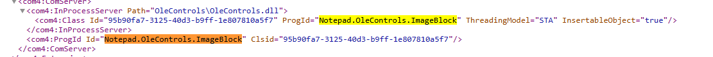
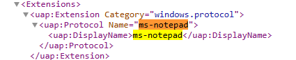
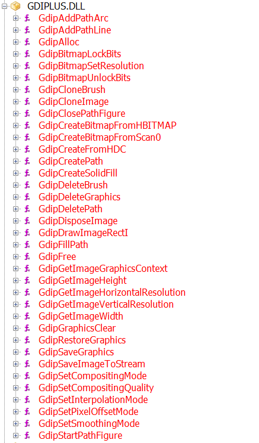
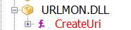
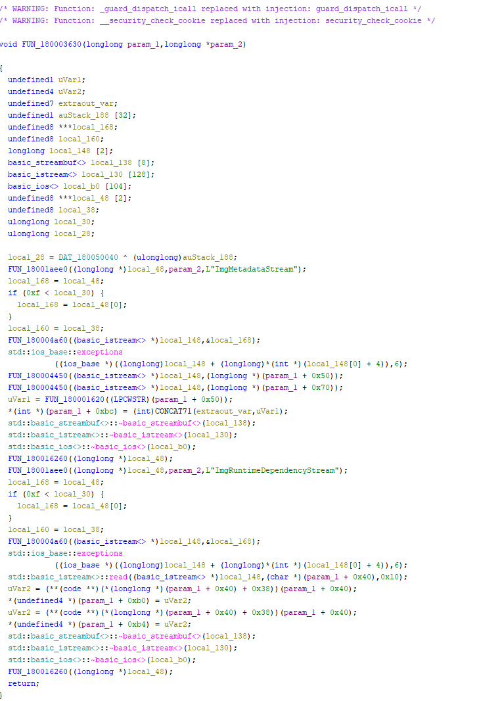
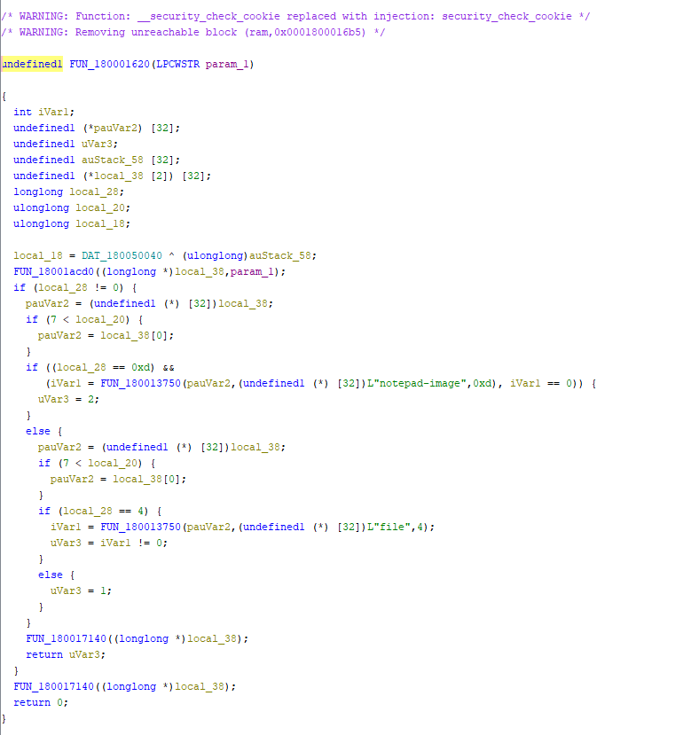
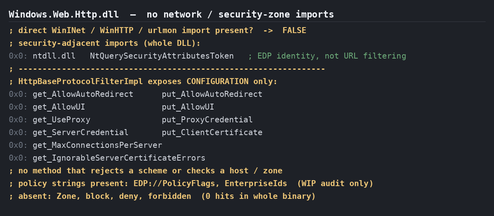
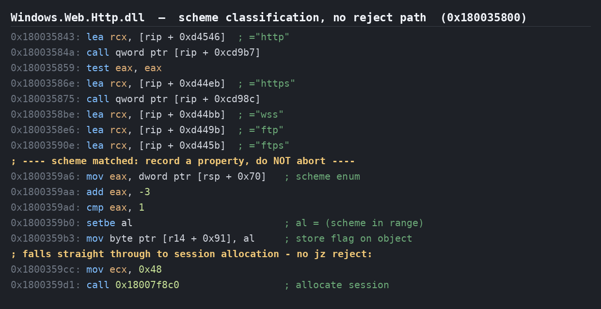

# Windows 11 Notepad — `OleControls.dll` ImageBlock: Static Analysis Notes

> **Status: research notes, not a confirmed vulnerability.**
> This is a static reverse-engineering analysis of code shipped inside the
> `Microsoft.WindowsNotepad` package. The image feature these code paths belong to
> is present in the binary but not yet functionally enabled in public Insider
> (Canary/Dev) builds at the time of writing. Nothing here has been confirmed
> dynamically. Where a conclusion is an inference from disassembly rather than an
> observed fact, it is called out as such. The remote-fetch behaviour described
> below should be read as a well-supported hypothesis, not as an established,
> exploitable bug.

## Summary

Windows 11 Notepad's upcoming inline-image feature is implemented as an OLE
embeddable object, internally called the "ImageBlock", living in
`OleControls.dll`. Static analysis shows a code path in which an image that a
document references by URL is fetched over HTTP by a WinRT `HttpClient`. Along
that path the URL's scheme is only classified, never security-validated, and no
application-level host allow-list or user consent prompt was found before the
request goes out.

Tracing the other half of the story inside `Notepad.exe` — the container that
hosts the object — shows that this URL is read, and the remote image source is
built, automatically while the document's content is being deserialized, with no
user interaction anywhere along the path. The single sub-step that static
analysis cannot pin down is whether the HTTP request fires at load time or is
deferred to the first render of the image; both are non-interactive, and only a
dynamic test can establish the exact instant.

Following the request one layer further down — into the system WinRT HTTP stack
(`Windows.Web.dll` / `Windows.Web.Http.dll`) that `OleControls.dll` hands the
request to — shows that this layer adds **no application-relevant scheme or host
enforcement** either. It classifies the URL scheme to select protocol handling and
records TLS/EDP properties, but there is no reject path for an unexpected scheme,
no host allow-list, and no security-zone gate. This closes, on the negative side,
the "the system runtime might enforce policy below what is visible" caveat that the
earlier revision of these notes left open for the HTTP vector: within these two
DLLs, no such application-level policy exists.

The same lack of source validation opens a second, potentially higher-impact
avenue: a UNC path (`\\host\share\x.png`) placed in the document is classified as
a local file, has its `\\` prefix normalized rather than rejected, and is handed
to a read-open — which on Windows would trigger SMB authentication and leak a
NetNTLMv2 hash to an attacker-controlled host. That vector's final link sits in a
component that could not be located and read, so it is a motivated hypothesis
rather than a fully traced chain; it is described in its own section below.

## Scope and environment

The target is `OleControls.dll` from the `Microsoft.WindowsNotepad` package,
version `11.2604.5.0`, x64. All work was done in Ghidra. Microsoft does not
publish a public PDB for this DLL, so the analysis was carried out without
symbols, helped by the RTTI strings the compiler left in the binary. The method
was the usual one: map the attack surface, find where untrusted input enters,
trace it towards dangerous operations, and identify the object's COM interfaces to
understand how the container drives it. No dynamic testing was possible because
the feature is not activatable in shipping builds.

The system WinRT HTTP DLLs analysed in the dedicated section below —
`Windows.Web.dll` (675,840 bytes) and `Windows.Web.Http.dll` (1,392,640 bytes),
both x64 — were examined separately with `pefile` + Capstone for imports,
strings, and targeted disassembly of the scheme-handling and send paths.

## Why this DLL is the interesting surface

The package manifest (`AppxManifest.xml`) registers a COM server for
`Notepad.OleControls.ImageBlock`, marked `InsertableObject="true"`, backed by
`OleControls.dll`. That single line is what turns a formerly text-only editor into
something that embeds and renders rich objects, which is exactly the kind of new
surface worth looking at.



The manifest also registers the `ms-notepad` protocol handler, a system-wide entry
point that any process — including a web page via the browser — can trigger.



On top of that it declares a broad set of file associations, including an
`anyfile` catch-all mapped to `*`, so Notepad offers to open essentially anything.
The content of a file you open is therefore fully attacker-controlled input, and
the ImageBlock is the component that processes the image parts of that content.

The DLL's import table tells us how images are handled and how the network is
touched. Rendering goes through GDI+: the imports include
`GdipCreateBitmapFromScan0` and `GdipBitmapLockBits`, which work on raw pixel
buffers, and notably there is no `Gdip*FromStream`, so no compressed-format decode
is delegated to GDI+ inside this DLL.



From `urlmon.dll` only `CreateUri` is imported, which is URI parsing, not
downloading. The actual network fetch happens through the WinRT
`Windows.Web.Http` stack instead, which we reach later in the chain.



## The chain inside `OleControls.dll`

### The URL comes from the document

`FUN_180003630` is the routine that deserializes an ImageBlock from the OLE streams
stored inside a document. It reads a stream called `ImgMetadataStream` into object
fields at offsets `+0x50` and `+0x70`, reads a second stream called
`ImgRuntimeDependencyStream` for the image dimensions at `+0xb0` and `+0xb4`, and
crucially runs the URL through a scheme classifier whose result it stores in a
type discriminant at offset `+0xbc`.



The relevant line is:

```c
uVar1 = FUN_180001620((LPCWSTR)(param_1 + 0x50));   // classify URL scheme
*(int *)(param_1 + 0xbc) = (int)CONCAT71(...,uVar1); // source-type discriminant
```

In other words, the value at `+0xbc` — which later decides whether to perform an
HTTP fetch — is derived directly from the scheme of a URL that came straight out
of the document. An attacker who crafts the document controls that URL, controls
its scheme, and therefore controls this discriminant.

### The scheme classifier is not a security check

`FUN_180001620` is the classifier. It builds an `IUri` from the string via
`CreateUri`, pulls out the scheme name with `GetSchemeName`, and maps it to a small
integer.



The mapping is simple: the scheme `notepad-image` returns 2, the scheme `file`
returns 0 or 1 depending on a further comparison, and everything else — `http`,
`https`, or any other scheme whatsoever — falls into the `else` branch and returns
1. There is no allow-list, no host inspection, no rejection of unexpected schemes,
   and no prompt. This is a type-sorting routine, not a validation routine, and its
   default outcome for anything that is not a local file or the custom
   `notepad-image` scheme is "treat as a remote source".

### Source type 1 drives an HTTP fetch, with no application-level check on the way

`FUN_18001c540` is a state machine driven by a `switch` on `param_1[8]`, and the
type-1 path is the one that goes to the network. It is entered when
`*(int *)(lVar26 + 0xbc) == 1`, i.e. when the source was classified as a remote
URL. Case 4 builds a `Windows.Web.Http.HttpClient`, sets a request User-Agent
header, and assembles the request from the document's URL:

```c
if (*(int *)(lVar26 + 0xbc) == 1) {                  // remote-URL source type
    // build-path strings present in this branch:
    //   ...\src\OleControls\...\winrt\Windows.Web.Http.h
    //   ...\src\OleControls\...\winrt\Windows.Web.Http.Headers.h
    *(wchar_t **)(param_1 + 0x3e) = L"Notepad (Windows NT 10.0)";  // User-Agent
    // ... request assembled from the document URL, then sent ...
}
```

Case 6 creates the request object and calls `SendRequestAsync` through vtable
offset `+0xa0` on the `Windows.Web.Http` object, and case 8 reads the HTTP response
into a stream and hands it to GDI+ (`GdipCreateBitmapFromScan0`,
`GdipBitmapLockBits`) for decoding.

The client itself is instantiated by `FUN_180014d50`, recognisable from the
runtime-class string it activates:

```c
local_58 = L"Windows.Web.Http.HttpClient";
// build path: ...\src\OleControls\...\winrt\base.h
FUN_1800149c0(local_78, (longlong *)&local_70,
              &DAT_1800469a8, (longlong *)&local_38);   // activate runtime class
```

Across cases 4, 6 and 8 there is no host comparison, no `http`/`https` allow-list,
no loopback or intranet check, and no user-consent prompt. The only string-shape
test anywhere near this path is one that distinguishes local `C:\`-style paths (a
letter followed by `:` and a slash), which is local-path normalization for the
file branch, not remote-URL validation.

One caveat belongs here, and it is now partially resolved. `Windows.Web.Http.HttpClient`
is a system WinRT runtime, so the `OleControls.dll` analysis by itself only
demonstrates the absence of application-level checks inside `OleControls.dll`. The
dedicated section below follows the request into that system runtime and finds no
application-relevant scheme/host policy there either; the one residual unknown is
the lowest transport layer (the WinINet provider beneath the WinRT filter), which
is generic system code shared by all callers rather than anything specific to
Notepad.

### The object is an OLE embeddable, renderable through IViewObject

The ImageBlock's `QueryInterface` (`FUN_180001e40`) walks an ATL interface map at
`DAT_180046d40`. Decoding the IIDs in that table shows that, alongside several
custom Notepad-internal interfaces, the object implements `IViewObject` (IID
`0000010D-0000-0000-C000-000000000046`, the rendering interface) and `IOleObject`
(IID `00000112-0000-0000-C000-000000000046`, the embedding interface). RTTI
confirms the class as `ATL::CComObject<...Image...>`. The `IUnknown` branch of the
QI is the standard ATL pattern:

```c
// IUnknown IID = {00000000-0000-0000-C000-000000000046}
else if ((*param_2 == 0) && (param_2[1] == 0) &&
         (param_2[2] == 0xc0) && (param_2[3] == 0x46000000)) {
    (**(code **)(*param_1 + 8))();   // AddRef
    *param_3 = param_1;              // return self
}
else {
    plVar3 = &DAT_180046d50;         // iterate the ATL interface map
    do { /* compare requested IID against each entry */ } while (*plVar3 != 0);
}
```

The presence of `IViewObject` matters because it means the container paints the
image by calling `Draw`, which happens when the image needs to be shown — typically
on open or view — rather than requiring an explicit activation like
`IOleObject::DoVerb`.

### The fetch is launched by a class method reached only through a vtable

The state machine is started by `FUN_180002a20`, which allocates the state object,
installs the state-machine function, records the source object, sets the initial
state and kicks it off:

```c
piVar6 = FUN_18001b8fc(0x840);                 // allocate state object
*(code **)(piVar6 + 2) = FUN_18001c530;
*(code **)piVar6       = FUN_18001c540;        // install state machine
*(longlong *)(piVar6 + 6) = param_1 + -0x18;   // source object
piVar6[8] = 0x10002;                           // initial state = 2
FUN_18001c540(piVar6, uVar7, piVar8);          // start
```

This function has no direct callers. Ghidra shows it referenced only as data: it
sits at index 8 of two ATL vtables (`1800463a0` and `180046640`), it appears in the
CFG guard table, and it has a `.pdata` entry. It is therefore invoked purely as
method 8 of the class vtable, dispatched by whatever code hosts the object.

The factory that builds the object, `FUN_180005290`, allocates 200 bytes,
zero-initializes the fields (including the `+0xbc` discriminant), and installs one
sub-vtable per COM interface the object exposes:

```c
plVar2 = FUN_18001b938(200);                        // allocate object
// ... zero-init fields ...
*(undefined4 *)((longlong)plVar2 + 0xbc) = 0;       // source-type discriminant = 0
*plVar2   = (longlong)ATL::CComObject<>::vftable;    // 7 interface sub-vtables
plVar2[1] = (longlong)ATL::CComObject<>::vftable;
// ... plVar2[2] .. plVar2[6], one per interface ...
```

## The chain inside the container (`Notepad.exe`)

The object that `OleControls.dll` implements has to be created and driven by
something, and that something is `Notepad.exe` itself. This is clear from the
symbols in that binary (`PageSetupDialog`, `NotepadTextBox`, `TabState`) and from
the fact that the ImageBlock CLSID `95b90fa7-3125-40d3-b9ff-1e807810a5f7` sits in
its data section right next to the `ImgMetadataStream`, `ImgRuntimeDependencyStream`
and `notepad-image` strings. So `Notepad.exe` is not a thin launcher; it is the OLE
container.

Following the deserialization path from the document end shows that the
ImageBlock's URL is read as an ordinary part of parsing the document's content,
with nobody clicking anything. When a document is opened, or a tab is restored, a
content-deserialization loop walks the serialized elements one by one and hands
each to a document-element dispatcher, `FUN_1401567d0`. That dispatcher is a large
switch over element tags — text, formatting, tables, and so on — and when it meets
tag `0x14` it calls the ImageBlock deserializer:

```c
case 0x14:
    uVar8 = FUN_140153890(param_2 + 0x1e);   // deserialize an ImageBlock element
    return uVar8;
```

There is no "user clicked" case here; this is sequential consumption of document
bytes, which is exactly what you would expect from a routine that turns a saved
file back into an in-memory document.

Inside the ImageBlock deserializer, `FUN_140156f10` first confirms that the
serialized object really is a `Notepad.OleControls.ImageBlock`, using a 30-byte
`memcmp` against that class name and throwing the serialization-subsystem error
GUID `1e626e63-28b3-4ae5-a02b-8bdb44df8ef6` if it is not, and then reads the
object's data. The metadata parsing itself is done by `FUN_1401517e0`, which
reconstructs a small C++ input stream over the raw bytes and decodes two
length-prefixed UTF-16 strings from it — one of which is the image URL. The length
prefix is a LEB128-style varint (read one byte at a time, seven bits of length per
byte, continue while the high bit is set), followed by that many wide characters.
This is worth recording precisely, because it documents the on-disk metadata
format that a hand-crafted proof-of-concept document would need to reproduce.

The lowest-level step, `FUN_140128b20`, is a small helper from `Common\OleUtils.cpp`
that actually pulls the bytes off disk: it opens the `ImgMetadataStream` via
`IStorage::OpenStream` (vtable offset `+0x20`) and then loops on `IStream::Read`
(offset `+0x18`) until the stream is exhausted. After the read loop, back up in
`FUN_140153890`, the parsed strings are used to build the image "source" object —
recognisable from the tagged pointers with the high bits set to `0xC000...` — and
that source is registered via `FUN_140151f70`. This is the moment the URL taken
from the document becomes a live image source inside the container.

Putting the two halves together, opening a document that contains an ImageBlock
causes Notepad to deserialize it during content parsing and to extract the URL and
build the remote image source automatically, without any user interaction.
Combined with the `OleControls.dll` chain, where a URL of type 1 leads to an HTTP
fetch with no application-level check, the entire setup of the remote request is
automatic on open.

## Following the request into the system WinRT HTTP stack

The `OleControls.dll` chain hands the outbound request to the WinRT
`Windows.Web.Http` runtime. Because that runtime lives below the application, the
earlier revision of these notes correctly flagged an open question: does the system
runtime itself impose any host or scheme policy that the application code does not?
To answer it, the two DLLs that implement this runtime — `Windows.Web.dll` and
`Windows.Web.Http.dll` — were analysed directly. The finding is that they add no
application-relevant scheme or host enforcement. The detail follows.

### No direct network or security-zone imports

`Windows.Web.Http.dll` imports no direct HTTP transport API and no security-zone
API. There is no `wininet.dll`, no `winhttp.dll`, and no `urlmon.dll` in its import
table, and consequently no `IInternetSecurityManager` / zone-mapping surface. The
only security-adjacent import in the entire DLL is `ntdll!NtQuerySecurityAttributesToken`,
which serves the Enterprise Data Protection (EDP/WIP) identity path, not URL
filtering. The DLL is therefore a WinRT projection layer that builds the request
object and delegates the actual send to a lower transport that is not one of these
two files.

The default filter that performs the connection, `HttpBaseProtocolFilterImpl`,
exposes only *configuration* properties — `AllowAutoRedirect`, `AllowUI`,
`UseProxy`, `ServerCredential`, `ProxyCredential`, `ClientCertificate`,
`MaxConnectionsPerServer`, `IgnorableServerCertificateErrors`, and so on. None of
these is a scheme/host gate, and there is no method resembling "reject if scheme
not allowed" or "check zone for host".



### The scheme is classified, never rejected

The one place the request scheme is examined is a small comparison table
(`https`, `ftps`, `wss`, `ftp`, `http`) around `0x180035800` in
`Windows.Web.Http.dll`. Crucially, the result of that classification feeds a
*property flag* and protocol selection — not an accept/reject decision. After the
comparisons, the code does:

```asm
0x1800359a6: mov   eax, dword ptr [rsp + 0x70]   ; scheme enum value
0x1800359aa: add   eax, -3
0x1800359ad: cmp   eax, 1
0x1800359b0: setbe al                            ; al = 1 if scheme in {3,4}
0x1800359b3: mov   byte ptr [r14 + 0x91], al     ; store boolean on the object
; execution falls straight through to session allocation:
0x1800359cc: mov   ecx, 0x48
0x1800359d1: call  0x18007f8c0                   ; allocate internal session
```

`setbe` writes a 0/1 byte recording a property of the scheme (e.g. "is
secure/https-like"); it does not branch to any error or abort path. There is no
`jz reject` / `jmp fail` anywhere across this table for an unrecognized scheme —
every comparison either records a flag or selects protocol handling, and control
then falls through into the internal-session allocation and continues. This is the
same shape as the `OleControls.dll` classifier: sorting by scheme, not validating
it.



### The only policy layer is EDP/WIP, which does not filter schemes or hosts

The single policy mechanism present in `Windows.Web.Http.dll` is Enterprise Data
Protection / Windows Information Protection, visible from the string cluster
`EDP://PolicyFlags`, `EDP://EvaluationFlags`, `EDP://EnterpriseIds`,
`EDP://ExemptEnterpriseIds`, `EDP://IntentEnterpriseId`. This tags requests with
enterprise identity for data-leak auditing/encryption on *managed* devices; it is
not a scheme filter or a host allow-list, and on an unmanaged consumer machine it
is effectively inert. Consistent with this, the whole binary contains no `Zone`,
`block`, `deny`, or `forbidden` string.

### What this settles, and the one residual unknown

Within these two DLLs, the "system runtime might enforce scheme/host policy below
the application" possibility is answered in the negative for the HTTP vector: the
runtime takes the `RequestUri` it is given, classifies the scheme to pick protocol
handling, applies TLS/EDP properties, and sends. Any scheme/host/consent check
would have to live in the caller (`OleControls.dll`), where the earlier sections
show there is none.

Two honest limits remain. First, these DLLs build and delegate; the final socket
I/O lives one layer further down, in the generic WinINet provider behind
`HttpBaseProtocolFilterImpl`. That transport is shared by every WinRT HTTP caller
on the system and is not specific to Notepad, so it is not expected to carry a
Notepad-specific host allow-list, but it was not itself disassembled here. Second,
the analysis remains static; on a device with WIP configured, the EDP flag implies
behaviour *could* differ under data-protection policy, which is worth a line in any
write-up.

## A second vector: UNC paths and NTLM credential leak

The same root cause — no validation of the image source before it is acted on —
opens a second, potentially higher-impact avenue. Everything above concerns the
`http`/`https` (type 1) path. But the classifier `FUN_180001620` has a `file`
branch and a fallback, and following those leads to local file access that does
not appear to reject remote UNC paths.

Recall how the classifier maps a source. It builds a URI with `CreateUri`, reads
the scheme, and returns a small integer. The subtle detail is the `file` branch:
it does `iVar1 = FUN_180013750(scheme, L"file", 4); uVar3 = iVar1 != 0;` — and
since `FUN_180013750` returns 0 on a match, the scheme `file` yields type **0**.
Just as important, a raw UNC path such as `\\host\share\x.png` is not a
scheme-bearing URI at all, so `CreateUri` produces no scheme and the function hits
its `return 0` fallback. Both a `file://host/share` URL and a bare `\\host\share`
path therefore converge on type **0**.

Type 0 is the `else` branch of the source switch in `FUN_18001c540`'s case 4 —
the local-file branch. And that branch does not reject UNC paths; it actively
**normalizes** them. The path-handling code there explicitly walks leading `\`
and `/` characters:

```c
do {
    if (((short)*puVar18 != 0x5c) && ((short)*puVar18 != 0x2f)) break;
    puVar18 = (uint *)((longlong)puVar18 + 2);   // skip leading \ or / (UNC prefix)
} while (puVar18 != puVar17);
```

After normalizing the path, it is handed to a method at vtable offset `+0x18` of
an object created earlier with `CoCreateInstance` (CLSID
`317D06E8-245F-433D-BDF7-79CE68D8ABC2`, interface IID
`EC5EC8A9-C395-4314-9C77-54D7A935FF70`), called with `GENERIC_READ` (`0x80000000`):

```c
pcVar8 = *(code **)(**(longlong **)(param_1 + 0x2e) + 0x18);   // open method
iVar12 = (*pcVar8)(*(undefined8 *)(param_1 + 0x2e), path, 0, 0x80000000);
```

The purpose of that call is to read the image bytes from the given path. On
Windows, opening `\\host\share\file` for reading — with any file API, because the
SMB redirector operates below them all — triggers an SMB connection and automatic
NTLM authentication. If an attacker sets the image source to
`\\attacker-ip\share\x.png` and has a listener such as Responder on the same
network segment, the victim's machine would authenticate to the attacker's share,
leaking a NetNTLMv2 hash usable for offline cracking or relay. Unlike the HTTP
case, this NTLM leak is a native Windows behaviour, not gated by security zones,
so it does not carry the HTTP path's "intranet-only auto-auth" limitation.

**What is proven here, and what is not.** Statically it is established that (a) a
UNC source reaches the local-file branch, (b) that branch normalizes rather than
rejects the `\\` prefix, and (c) the normalized path is passed to a read-open with
`GENERIC_READ`. The missing link is the object behind CLSID `317D06E8`: its
`+0x18` open method is where a defensive UNC-reject check could still live, and
that object is **not implemented in `OleControls.dll`** (its IID appears only once,
as the interface requested at `1800461b8`, with no implementing vtable in this
binary). The package manifest (`AppxManifest.xml`) was re-checked directly against
this CLSID and it appears nowhere in it: the only COM/activatable servers the
package registers are `CA6CC9F1-…` → `NotepadExplorerCommand.dll`,
`95b90fa7-…` → `OleControls.dll` (the ImageBlock itself), and the
`NotepadXamlUI.*` activatable classes → `NotepadXamlUI.dll`. The open component is
therefore **not shipped by the Notepad package**; it is an external system
component, resolved either through the system COM catalog or via a dependency such
as `Microsoft.WindowsAppRuntime.1.7`. Because the image feature is inert in
shipping builds, the corresponding `CoCreateInstance` has presumably never run, so
the CLSID is not present in the accessible packaged registry and its GUID does not
appear as a string in any package DLL — which is why the component could not be
located and read from the package alone. Its behaviour (a `+0x18` method that opens
a path for `GENERIC_READ` and returns a stream) is consistent with a file/stream
abstraction from the system storage stack. Nothing in the controllable code
suggests a UNC filter — quite the opposite, since the upstream branch deliberately
accepts and normalizes UNC — but the final open component could not be inspected.
This vector is therefore a **motivated hypothesis with its last link open**, a
notch below the HTTP vector, whose chain is fully visible inside `OleControls.dll`.
Confirmation would come trivially from a network capture (a SYN to port 445 on an
attacker-controlled host on document open), which is not currently possible because
the feature is inert. Locating the component itself would come from a binary search
of the system image for the IID/CLSID bytes (`EC5EC8A9…` / `317D06E8…`) across
`System32`, `SysWOW64`, and `WinSxS`, on a build where the feature is present.

## What is not established

Three things remain genuinely open, and it is important to be precise about them.

The first is the exact instant the request fires. The end-to-end static trace shows
that the URL is read and the remote source is built automatically when the document
is opened. What it does not pin down is whether the HTTP request goes out
immediately during load or is deferred to the first render or layout pass over the
image. Both possibilities are non-interactive, so the "no click required" character
of the behaviour does not depend on the answer, but only dynamic observation can
say exactly when the packet leaves. This point is strongly supported as automatic;
the precise timing is unconfirmed.

The second is the lowest transport layer. The application code (`OleControls.dll`)
and the WinRT projection layer (`Windows.Web.dll` / `Windows.Web.Http.dll`) have
both now been examined and neither applies an application-relevant host/scheme
policy. The remaining unexamined layer is the generic WinINet provider beneath
`HttpBaseProtocolFilterImpl`, which is system-wide code shared by all WinRT HTTP
callers rather than anything Notepad-specific. It was not disassembled here, and on
a WIP-managed device the EDP path could in principle change behaviour.

The third is simply that none of this has been observed at runtime, because the
feature cannot be activated in shipping builds.

## Why it would matter if confirmed

If the trigger is automatic and no runtime check exists, opening a crafted document
would cause Notepad to issue an HTTP request to a host of the attacker's choosing,
carrying the distinctive `Notepad (Windows NT 10.0)` User-Agent. The impact would
sit in the SSRF, information-leak and silent read-receipt family — the moral
equivalent of a tracking pixel hidden inside what looks like a text file — and it
would additionally deliver attacker-controlled bytes to the GDI+ decoder. This is
the same class of risk that commentators raised publicly when the feature was
announced, and it rhymes with the earlier Markdown-link issue (CVE-2026-20841),
which Microsoft hardened by adding URI checks and user prompts.

The UNC/SMB variant, if its final link holds, would be materially worse than the
HTTP one. Rather than leaking an IP and an open-confirmation, it would leak a
NetNTLMv2 hash — an authentication credential — simply on opening a document,
enabling offline cracking or NTLM relay and, in a domain environment, a foothold
for lateral movement. That moves the ceiling from privacy/tracking to credential
theft. It is the reason the UNC branch is worth flagging even though its last step
is unconfirmed.

## Responsible next steps

This should not be treated as a live vulnerability. The code path is not
user-reachable in shipping builds, and Microsoft may well add prompts or validation
before general release, exactly as they did for CVE-2026-20841; the code visible
today may not be the code that ships.

Because the on-disk metadata format is now understood — element tag `0x14`, the
class string `Notepad.OleControls.ImageBlock`, and an `ImgMetadataStream` holding
varint-length-prefixed UTF-16 strings including the URL — a test document could in
principle be built by hand rather than relying on the currently inert UI button.
The verification itself is simple and low-impact: point the URL at a local
listener, open the document, and watch whether and when a request arrives.

If that reproduces, the right destination is MSRC (https://msrc.microsoft.com),
and an observational proof-of-concept — a captured request landing on your own
listener — is entirely sufficient. No memory-corruption exploit is needed or
appropriate.

## Key functions and offsets

The following table collects the functions referenced above for quick lookup.

| Item | Binary / source | Role |
|---|---|---|
| `FUN_180003630` | OleControls (ImageBlock) | Deserialize from OLE streams; sets `+0xbc` |
| `FUN_180001620` | OleControls (StringUtils) | URL scheme to source-type (no security check) |
| `FUN_180001e40` | OleControls | `QueryInterface`; interface map at `DAT_180046d40` |
| `FUN_18001c540` | OleControls (ImageBlock) | State machine; HTTP fetch on cases 4/6/8 |
| `FUN_180014d50` | OleControls | Instantiates `Windows.Web.Http.HttpClient` |
| `FUN_180002a20` | OleControls | Starts state machine; class vtable method 8 |
| `FUN_180005290` | OleControls | Factory/constructor; installs 7 sub-vtables |
| `FUN_1401567d0` | Notepad.exe | Document-element dispatcher; case `0x14` is ImageBlock |
| `FUN_140153890` | Notepad.exe | ImageBlock deserialization loop |
| `FUN_140156f10` | Notepad.exe | Validates class name; reads metadata |
| `FUN_1401517e0` | Notepad.exe | Parse metadata (varint + UTF-16 strings; URL) |
| `FUN_140128b20` | Notepad.exe (OleUtils) | Reads `ImgMetadataStream` (OpenStream then Read) |
| ImageBlock CLSID | Notepad.exe | `95b90fa7-3125-40d3-b9ff-1e807810a5f7` |
| `+0xbc` | object field | Source-type discriminant (1 = remote URL, 0 = file/UNC) |
| File-open method | OleControls case 4 | vtable `+0x18` on CLSID `317D06E8`, `GENERIC_READ` |
| Open component CLSID | external (not found) | `317D06E8-245F-433D-BDF7-79CE68D8ABC2` |
| Open component IID | `1800461b8` | `EC5EC8A9-C395-4314-9C77-54D7A935FF70` |
| User-Agent | OleControls case 4 | `Notepad (Windows NT 10.0)` |
| `IViewObject` IID | `180046e50` | `0000010D-...-46` (rendering) |
| `IOleObject` IID | `180046e60` | `00000112-...-46` (embedding) |

### System WinRT HTTP stack (`Windows.Web.dll` / `Windows.Web.Http.dll`)

| Item | Binary | Role / finding |
|---|---|---|
| Scheme table `0x180035800` | Windows.Web.Http | Compares `https/ftps/wss/ftp/http`; classifies, no reject path |
| `setbe [r14+0x91]` @ `0x1800359b0` | Windows.Web.Http | Records scheme property; falls through to session alloc |
| `HttpBaseProtocolFilterImpl` | Windows.Web.Http | Default filter; exposes configuration only (redirect/proxy/creds/cert) |
| `HttpClientImpl::CheckHttpRequestMessage` | Windows.Web.Http | Message-structure check; not a scheme/host gate |
| `NtQuerySecurityAttributesToken` | Windows.Web.Http | Only security-adjacent import; EDP identity, not URL filtering |
| `EDP://PolicyFlags` (+ EnterpriseIds) | Windows.Web.Http | WIP audit/tagging only; not a scheme/host filter; inert unmanaged |
| Direct `wininet`/`winhttp`/`urlmon` imports | Windows.Web.Http | **None** — projection layer; transport is one layer further down |
| `Zone` / `block` / `deny` / `forbidden` strings | Windows.Web.Http | **0 occurrences** in the binary |

---
*Static analysis notes, no dynamic confirmation. Shared for research documentation;
verify before drawing conclusions.*
